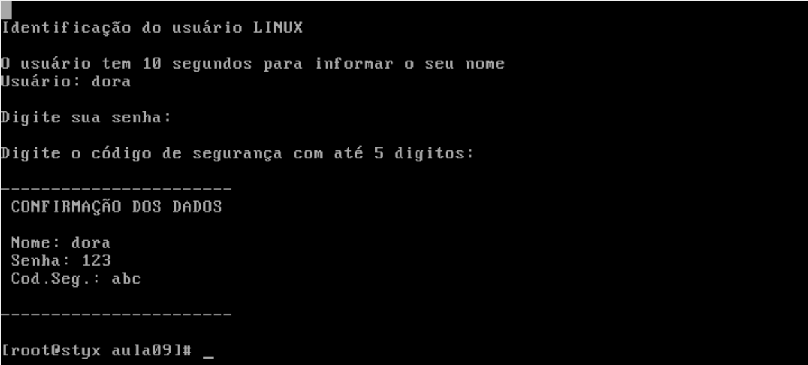

# Problemas 🇧🇷

Abaixo estão os enunciados dos scripts abordados nesta aula:

## Script 1 - Conversão de Tempo de Execução

Um programador executou um programa e cronometrou o tempo de execução em segundos. Com essa informação, desenvolva um script que converta o tempo em minutos e segundos.

### Propósito

O objetivo deste script é facilitar a conversão de tempos de execução cronometrados, tornando mais fácil a leitura e compreensão do tempo total em um formato mais intuitivo (minutos e segundos).

## Script 2 - Autenticação no Ambiente Linux

Desenvolva um script que promova a autenticação no ambiente Linux, conforme o layout especificado abaixo.

### Propósito

O objetivo deste script é fornecer uma solução para autenticação de usuários no ambiente Linux, seguindo um layout específico.

### Layout de Autenticação

O layout de autenticação deve incluir os seguintes elementos:
- Solicitação de nome de usuário
- Solicitação de senha
- Verificação das credenciais fornecidas

# Challenges 🇺🇸

Below are the prompts for the scripts covered in this lesson:

## Script 1 - Runtime Conversion

A programmer ran a program and timed its execution in seconds. With this information, develop a script that converts the time into minutes and seconds.

### Purpose

The purpose of this script is to facilitate the conversion of timed execution, making it easier to read and understand the total time in a more intuitive format (minutes and seconds).

## Script 2 - Linux Environment Authentication

Develop a script that facilitates authentication in the Linux environment, following the specified layout below.

### Purpose

The purpose of this script is to provide a solution for user authentication in the Linux environment, adhering to a specific layout.

### Authentication Layout

The authentication layout should include the following elements:
- Prompt for username
- Prompt for password
- Verification of provided credentials
